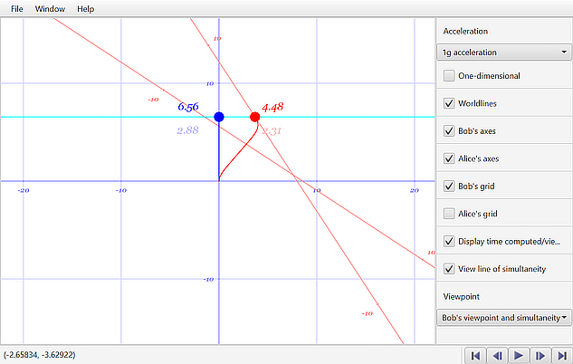

# Gamma  - A Minkowski Spacetime Diagram Generator 

Gamma is a  tool you can use to draw a wide variety of 2D Minkwoski spacetime diagrams.
In addition to the usual static diagrams, you can also create animated diagrams and
you can add toggles, choices, and sliders to manipulate the diagram.

You specify the problem using a special language designed specifically for the
task; the tool generates the diagram from your specification. For example, this 
code would create a simple diagram with two observers, one moving at 80% the 
speed of light relative to the other. The axes for the stationary observer drawn,
as are the worldlines for both observers.

```
observer1 = [observer ];
observer2 = [observer velocity .8];

axes ;
worldline observer1, style: "color: blue";
```

The best way learn about Gamma is to download the application and run the sample
scripts (Gamma programs) under **Help / Sample Scripts**.

<details><summary>Screenshots</summary>





</details>

## Features

### Commands used for drawing 

 - Axes - relative to any inertial frame
 - Grids - relative to any inertial frame
 - Hypergrids
 - Events
 - Worldlines
 - Lines
 - Paths
 - Labels 

### Physics-based Objects

- Coordiantes
- Inertial frames
- Observers
- Lines
- Paths
- Bounds
- Intervals

### Expressions

- Floating point numbers and character strings
- Variables, including animated variables and variables controlled by the end user
- All common mathematical operators, including one especially for Lorentz transformations
- All common mathematical functions, as well as a number of relativity-related functions

### Other features

- Specify observers whose worldlines include multiple segments with varying acceleration
- Extract the instantaneous moving frame for any observer at any point along their worldline
- Create lines parallel or intersecting the axes of any inertial frame
- Find the intersection of lines or a line and a worldline
- Given a point on a worldline, get the matching velocity, x position, time, or tau
- Specify a problem relative to one inertial frame and draw it relative to another
- Completely customize the appearance of the diagram (color, line thickness, line style, fonts, etc.)

## Download and install

There are currently three installers:

- An [MSI installer](https://github.com/freixas/gamma/releases/download/1.0.0-alpha3/gamma-1.0.0.msi) for x64-based Windows 10 systems (likely to work on x64 Windows 7 and 8).
- A [DEB package](https://github.com/freixas/gamma/releases/download/1.0.0-alpha3/gamma_1.0.0-1_amd64.deb) for x64 Debian-based Linux distributions
- A [DMG package](https://github.com/freixas/gamma/releases/download/1.0.0-alpha3/gamma-1.0.0.dmg) for x64-based MacOS 11 systems (might work on MacOS 10.5)

For other systems (x32-based systems, Macs with M1, other Linux distributions), 
there is a universal tar.gz file which should work as long as you can find
suitable Java and JavaFX packages. 

### Installation Instructions

<details><summary>Installing on Windows</summary>

- Download the file.
- In Explorer, double-click on the MSI file. Follow the prompts.

</details> 

<details><summary>Installing on Linux</summary>

- Download the file.
- In the Linux file manager, double-click on the DEB file. Follow the prompts.

Alternately, from a terminal window, type:

`sudo apt install <path-to-DEB-file>`

</details>

<details><summary>Installing on the Mac</summary>

- Download the file.
- In Finder, double-click on the DMG file. Follow the prompts and move the gamma icon into the Applications folder.

**IMPORTANT:** Because I am not willing to pay Apple $99/year to sign and notarize my open-source
software, the application will appear to install properly, but will complain about
being "damaged" and won't run.

To run the application, you will need to bring up a terminal window and enter
these commands:

```
cd /Applications
sudo xattr -r -d com.apple.quarantine gamma.app
```

</details>

<details><summary>Installing the universal tar.gz file</summary>

To install the universal tar.gz file, you will need to know how to:

- Enter DOS (Windows) or shell (Mac/Linux) commands.
- Define a persistent environment variable.
- Unpack a tar.gz file.
- Add a path to the PATH environment variable.

<details><summary>Install Java</summary>

Download and install Java JDK 17.0.2 (or later) from 

https://www.oracle.com/java/technologies/downloads

This is also called "Java SE Development Kit 17.0.2". The page includes a link
to installation instructions in the section on "Release Information".

There are also open source versions at https://jdk.java.net/17.
These versions don't include installers or even installation instructions.

To verify that Java is installed properly, type: 

`java --version` 

in a cmd.exe or terminal window. This should output something starting with 

`java version "17.0.2"`.

Make sure that the JAVA_HOME variable is set. Using a terminal window, enter:

  `echo %JAVA_HOME%` (Windows)

  `echo $JAVA_HOME` (Mac/Linux)

If this does not display path, set JAVA_HOME to the path where Java
was installed. On Windows, locate the top of the Java installation (usually
something like C:\Program Files\Java\<version>). Then, in a terminal window,
type:

`setx JAVA_HOME "C:\Program Files\Java\<version>"`

On Mac/Linux, use the "which" command in a terminal window to find the java
executable:

`which java`

Remove "/bin" from the path. This should be your JAVA_HOME value. You will need
to set it in whatever profile file you are using: ~/.bash_profile, ~/.profile,
or others. In this file, enter:

`JAVA_HOME="<path>"`

You may have to log out/in to make this effective.
</details>

<details><summary>Install JavaFX</summary>

Download and install JavaFX 17.0.2 [LTS] (or later) from

https://gluonhq.com/products/javafx/

(for Type, select SDK)

The download should be a ZIP file. You can place the javafx-sdk-17.0.2
folder anywhere.

You will need to create a JAVAFX_HOME environment variable. The JAVAFX_HOME path
should point to the top of the unpacked ZIP file.
</details>

<details><summary>Install Gamma</summary>

Unzip the Gamma installation package to any location. If you unpacked the file
into <some path>, then add `<some path>\app` (Windows) or `<some path>/app` (Mac/
Linux) to your PATH.
</details>

<details><summary>Running Gamma</summary>

To run Gamma from a terminal window, enter:

`gamma.bat` (Windows)
`gamma` (Mac/Linux)

You may be able to link the command to a desktop icon to make it more
convenient to run. You may still see a brief appearance of a terminal window.
</details>
</details>

## Building

To build the application from source, you will need to get and install:

- Java 17.0.2 or later. The Java executables need to be on your path.
- Maven, version 3.8.4 or later
- Git, version 2.34.1 or later
- For Windows, [the latest WiX toolset](https://wixtoolset.org/releases/).

Using git, clone the branch or tag you are interested in:

- The latest branch is the highest numbered on in the form _n_._m_.x.
- To build version n.m, look for the tag _n_._m_._b_. If there are multiple tags, the one with the largest _b_ value is the latest.

In the top level folder, type `mvn clean package`

When the dust settles, The target folder will contain an installer for your system
as well as the universal ZIP file.

## Contributing

Currently, I'm looking for physicists willing to install and review the 
application. Open [an issue](https://github.com/freixas/gamma/issues) for bugs, 
but send general comments to [gamma@freixas.org](mailto://gamma@freixas.org).

If you'd like to contribute to the code, write to [gamma@freixas.org](mailto://gamma@freixas.org)
with your ideas for changes.

## License

Gamma is licensed under [GPLv3](https://www.gnu.org/licenses/gpl-3.0.en.html). 

## Contact

- Found a bug? Create [an issue](https://github.com/freixas/gamma/issues) on GitHub.
- Comments or questions? Start [a discussion](https://github.com/freixas/gamma/discussions) on GitHub.

Or write to [gamma@freixas.org](mailto://gamma@freixas.org).

Gamma was written by Antonio Freixas.